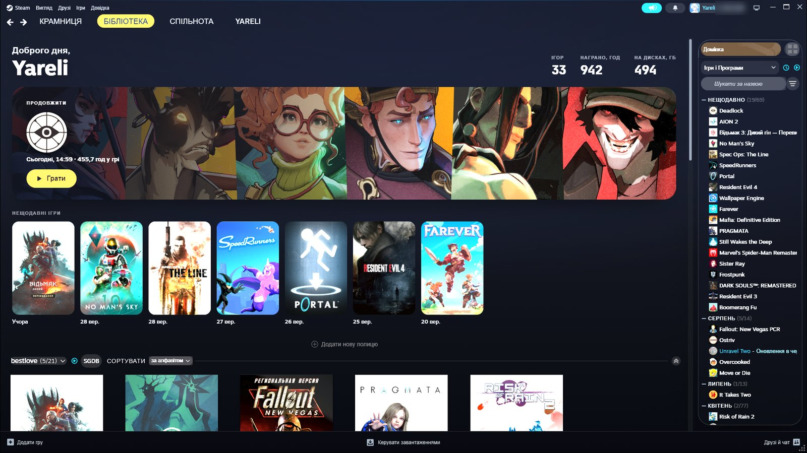
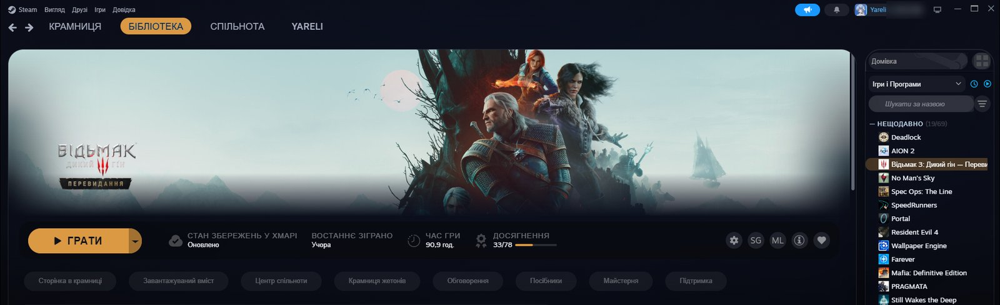
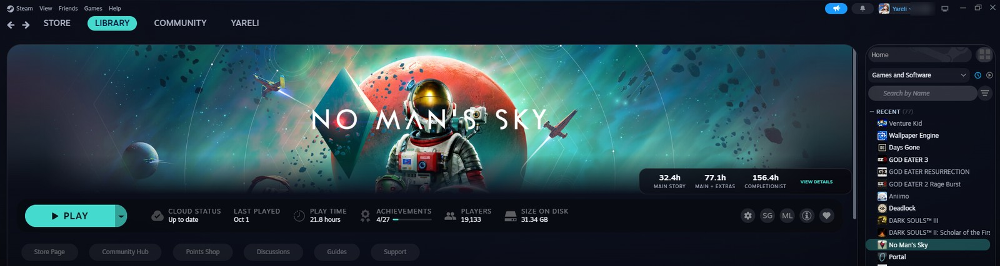
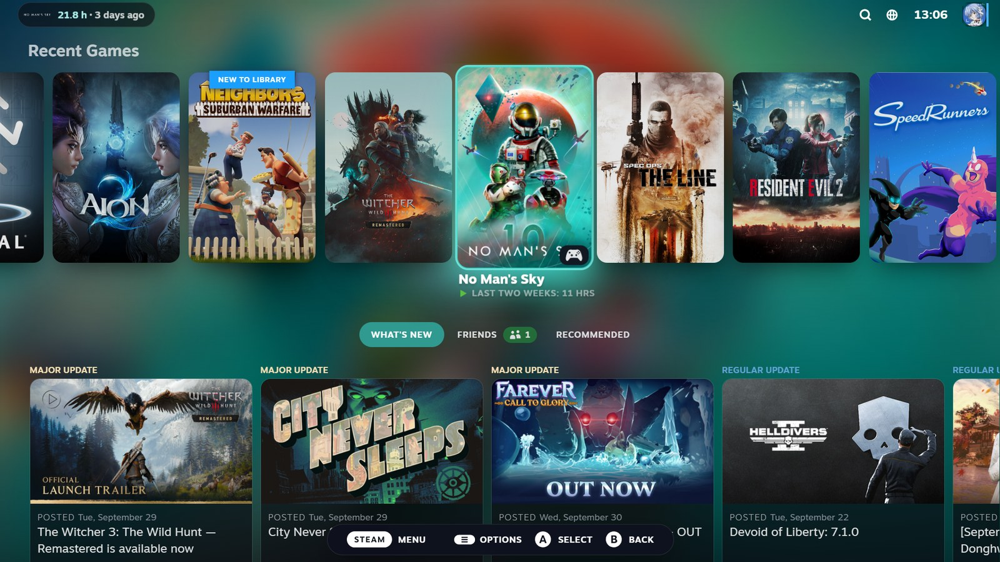

# Glass Dusk

A [Millennium](https://steambrew.app) theme for the Steam desktop client. Smoked glass panels sit over the art of the game you have open, and the client takes its accent colour from that art. Open another game and the whole client changes colour with it.

## What it styles

- **Library.** Two panes of smoked glass over the blurred art of the open game, with the game list on the right. The home page gets its own header: greeting, library stats, *Continue* for the last game, recent games.
- **Game page.** The hero art runs edge to edge, the play bar is one flat card, and page links become chips.
- **Store.** A game's page uses its art and colour. Everything else sits on a plain dusk ground.
- **Menus, settings, notifications, friends and chat.** All wear the same colour as the main window.
- **Plugins.** Millennium plugins with an interface of their own take the theme's colours: HLTB for Steam, Achievement Groups, Player Count, Extendium. Size on Disk, Non-Steam Playtimes and Easy SteamGrid match as they are. Browser extensions added through Extendium (SteamDB, Augmented Steam) put their blocks on store pages in the same cards as Steam's own.
- **Community and profiles** stay as Steam draws them. Profiles carry their owners' own backgrounds and themes, and a half-restyled community reads worse than an untouched one.
- **Big Picture.** The focused game's art fills the home screen and lends its colour to focus rings and tabs. A chip at the top left shows its hours and when you last played.
- **In-game overlay (Shift+Tab).** A light veil replaces Steam's near-black sheet, so the game stays visible. *Game Overview* and the toolbar become smoked glass in the running game's colour.

## Settings

Millennium → Themes → Glass Dusk → ⋯ → Settings. Changes apply after Steam restarts.

| Setting | Values | What it does |
|---|---|---|
| Theme language | **English** · Українська | Text the theme draws itself: home header, Big Picture chip, dates. Steam's own text follows Steam. |
| Background | **Game art** · Meadow · Plain dusk | What sits behind the glass. |
| Background art | **Normal** · Subtle · Vivid | How strongly the game art shows through. |
| Accent colour | **Game art** · Fixed | *Fixed* keeps the Accent colour from the Colors tab everywhere. |
| Glass | **Normal** · Denser · Sheerer | How see-through the panels are. |
| Corners | **Normal** · Softer · Sharper | Radius of panels and cards. |
| Library home | **Theme** · Steam | The theme's home header, or Steam's shelves only. |
| What's New shelf | on · **off** | Steam's What's New shelf on the home page. |
| Game list side | **Right** · Left | Where the game list sits. |
| Big Picture | **Cover** · Steam | Whole-screen art of the focused game, or Big Picture untouched. |
| Big Picture hours chip | **on** · off | Logo, hours played and last played at the top left. |
| Overlay background | **Transparent** · Steam | Behind the Shift+Tab panels. |
| Overlay panels | **Glass** · Steam | *Game Overview*, the browser and the toolbar. |
| Plugins | **Theme** · Plugin's own | Plugins with their own interface: in the theme's colours, or as they ship. |

The **Colors** tab has six colours: accent, text, secondary text, glass tint, play bar, store background.

## Install

- **From steambrew.app:** open [Glass Dusk in the theme catalogue](https://steambrew.app/theme/0hs3xMU5Eb85uvIALzkq), press *Copy Theme ID* and paste it into Millennium → Themes → Install.
- **By hand:** download this repository and put the folder into `Steam/millennium/themes/`, then pick it in Millennium → Themes.

Tested on Windows 11 with Steam client 1788652215 and Millennium 3.5.0.

## Good to know

- The overlay cannot blur the game behind its panels. Steam composites the game outside the page, so the glass there is a denser tint instead.
- Very large custom artwork slows Big Picture down, with or without this theme. Animated PNG covers from SteamGridDB can run to tens of megabytes. If Big Picture stutters when a cover scrolls into view, a lighter version of that cover helps.
- The Big Picture chip is information only: a controller can't select it.

## Support

The theme is free and stays free. If you like it, you can leave a tip on [Ko-fi](https://ko-fi.com/yareli0i). Bugs and ideas go to [Issues](https://github.com/Yareli0i/glass-dusk/issues).

## Credits

- Code: [MIT](LICENSE).
- Number font: JetBrains Mono ExtraBold, [SIL OFL 1.1](assets/OFL-JetBrainsMono.txt).
- Meadow background: by the author.
- Game art is shown straight from your Steam library and belongs to its owners.

Changes: [CHANGELOG.md](CHANGELOG.md). How the theme is put together: [DEVELOPMENT.md](DEVELOPMENT.md).

---

## Українською

Тема для Steam на Millennium: димчасте скло поверх арту відкритої гри, а колір кнопок і виділень береться з цього арту. Стилізує бібліотеку, сторінку гри, крамницю, меню, Big Picture й оверлей у грі. Спільноту й профілі лишає такими, як їх малює Steam.

Текст, який малює сама тема, за замовчуванням англійський. Українську вмикає налаштування **Theme language → Українська**. Решту налаштувань описано в таблиці вище, змінюються вони в Millennium → Themes → Glass Dusk → Settings і діють після перезапуску Steam.
